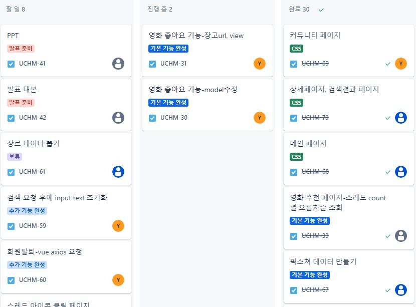
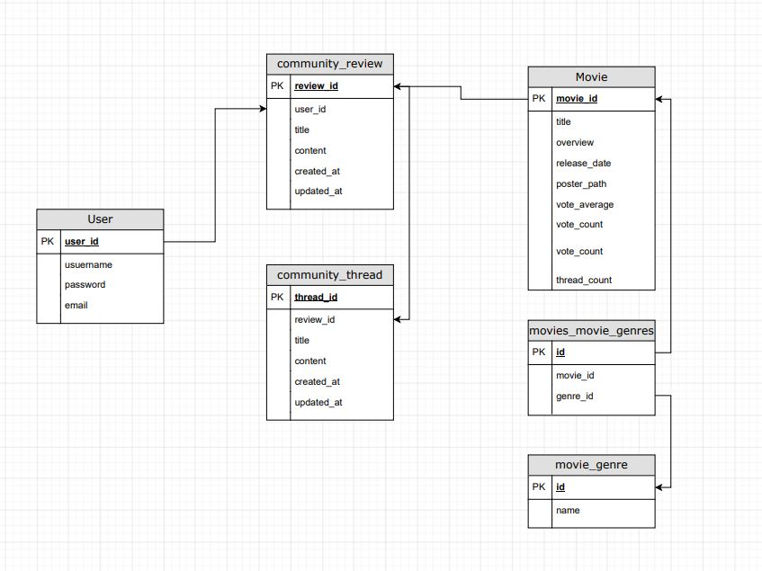
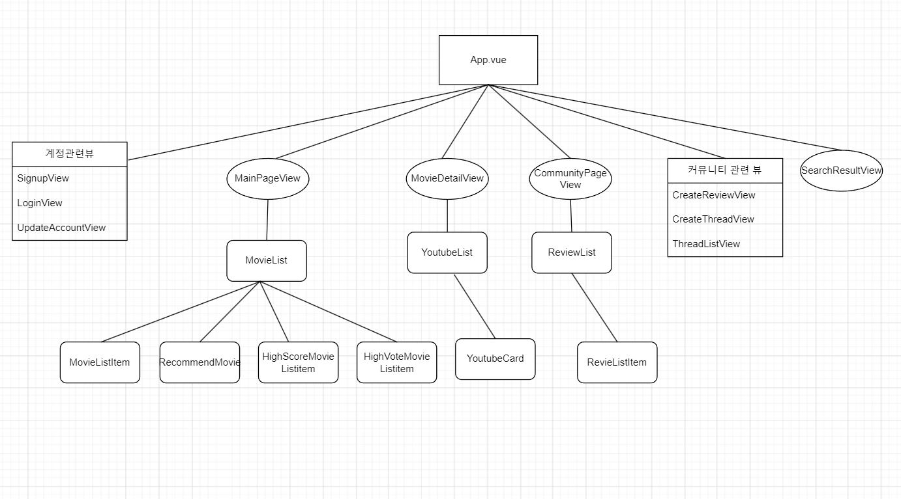

# 1. 팀원 정보
    1.1 팀원 정보
        팀장 : 박예분
        팀원 : 황유경

    1.2 업무 분담 내역
     : 지라(Jira)를 이용하여 해야 할 일, 진행 중, 완료된 내역을 수시로 확인했고  기본기능 구성, CSS구현, 부가기능 순으로 우선순위를 나누어 진행하였습니다.
    

        박예분 
            - ERD 설계 
            - Django 모델. serializer 구성
            - Django URL, Views 등 백엔드 기본 기능 구현
                로그인, 로그아웃, 회원가입, 영화 정보 조회 및 저장, 리뷰 및 스레드 작성 및 수정 기능 등 
            - Vue,Django : 로그인 사용자, 게시글 작성자만 접근 가능하도록 권한 설정 
            - CSS 커뮤니티 페이지, 로그인, 회원가입 페이지 작업 

        황유경 
            - ERD 설계 
            - Vue 화면 전반 컴포넌트 구성 및 구현 
                로그인, 로그아웃, 메인페이지, 영화 목록 조회 페이지, 검색화면, 리뷰 및 스레드 작성 페이지 구현 
            - Vue API, 비동기 방식을 활용한 데이터 수집 및 Django서버 저장
            - Vue에서 Django서버로부터 데이터 가져와 각 화면에 출력 
            - 유튜브 검색 기능 추가 구현
            - CSS 메인페이지, 상세정보 페이지, 검색 결과 페이지 작업

# 2. 목표 서비스 구현 및 실제 구현 정도

    2.1 목표 
    : TMDB 영화 데이터를 기반으로 영화 정보 조회 및 추천해주는 기능을 제공합니다. 또한, 각 영화에 대한 리뷰 게시글이나 
        여러 사람들끼리 소통하며 좋아하는 영화에 대해 소통할 수 있는 커뮤니티 게시판을 구현합니다. 

    2.2 실제 구현 정도 : 
    : API 요청으로 TMDB로부터 데이터를 받아와 영화 정보를 조회할 수 있습니다. 커뮤니티에서는 각 영화에 대한 리뷰 게시글 작성이 가능하고, 
        그 게시글에 트위터의 타래 기능 처럼 대댓글 형식의 쓰레드 작성 기능도 함께 제공됩니다. 사용자는 이 쓰레드 항목을 이용하여 
        메인 페이지에서 쓰레드가 가장 많은 순으로 영화를 추천받을 수 있고, 그 외에도 현재 상영작, TMDB 평점이 높은 순서, 
        투표수가 많은 순서대로 영화를 추천받을 수 있도록 구현하였습니다. 또한 추가기능으로 유튜브 API를 이용하여 
        실시간으로 검색결과를 받아 볼 수 있는 페이지도 구현하였습니다. 

# 3. ERD(데이터베이스 모델링 설계 )
    3.1 ERD 개요 
    : User모델, Community review, thread 모델, Movie모델, Genre모델을 만들어 사용하였습니다. 
        User-review (작성자-게시글 관계 , 1:N)
        review-thread (영화 리뷰 게시글 - 게시글의 댓글, 1:N)
        Movie - review (영화에 대한 리뷰, 1:N)
        Movie - Genre (N:M) 
        으로, 관계를 설정하고 ERD를 작성하고 Django 모델을 작성하였습니다.

    3.2 컴포넌트 구조

# 4. 영화 추천 알고리즘에 대한 기술적인 설명 

    4.1 영화 추천 알고리즘 : 스레드 많은 순, 평점이 높은 순, 투표자가 많은 순 

        4.1.1. 작성된 스레드가 많은 순으로 추천 

            - Thread 모델에 Review모델을 외래키로 참조하고, 작성자 정보를 저장하기 위해 user필드로
                Django의 AUTH_USER_MODEL을 외래키로 참조 

            -  Django에서 '스레드와 연결된 리뷰, 리뷰와 연결된 영화' 의 관계를 활용하여 영화에 달린 스레드 개수 카운트
            - 스레드를 작성하면 장고 서버에 저장되고, filter 를 이용하여 현재 영화에 연결된 리뷰에 대한 모든 스레드 개수를
                카운트하여 업데이트

            - Vue에서 Django서버로 Get요청을 하여 영화에 대한 스레드 개수를 가져와 computed 속성과 toSorted를 이용하여 
                지속적으로 스레드가 많은 수부터 적은 수로 내림차순 정렬 하고 그 중 상위 10개의 영화를 출력해 
                사용자에게 추천해 주는 추천 알고리즘을 구현

        4.1.2 평점이 높은 순으로 추천

            - TMDB로 받아온 데이터 중 vote_average 속성을 이용하여 평점이 높은 순부터 낮은 순으로 toSorted를 이용하여 정렬

            - 상위 10개 영화 추천

        4.1.3 투표자가 많은 순으로 추천

            - TMDB로 받아온 데이터 중 vote_count 속성을 이용하여 평점이 높은 순부터 낮은 순으로 toSorted를 이용하여 정렬

            - 상위 10개 영화 추천

# 5. 서비스 대표 기능

    5.1 입소문 내기, 타래 작성하기

        : 입소문을 타고 유명해지는 여러 콘텐츠를 모티브로 한 기능

        - 영화 상세페이지에서 입소문 내기 버튼을 클릭하면 게시글을 작성할 수 있는 폼이 나오고, 작성을 완료하면 커뮤니티 페이지에 눈모양 아이콘이 생성
        - 눈 모양 아이콘이 각각 하나의 영화 리뷰를 나타냄
        - 눈 모양 이이콘을 클릭하면 타래를 작성할 수 있고, 리뷰 제목을 클릭하면 아래로 이제까지 작성했던 타래들이 연결되어 보여짐
        - 각 리뷰나 타래의 수정은 로그인이 되어있고, 각 게시글의 작성자만 가능함
        - 타래가 가장 긴 영화는 메인 페이지의 가장 상단인 오늘의 추천작에 순위 순으로 나열 됨

    5.2 영화 리스트 조회

        - 메인 화면에서 추천영화, 현재 상영중인 영화, 평점이 높은 영화, 투표자수가 많은 영화를 한 눈에 확인 할 수 있고,
            각각의 영화카드를 클릭하면 상세페이지로 상세 정보 확인 가능
        

    5.3  상세페이지의 실시간 유튜브 검색 기능 
        
        - 각 영화를 클릭하면 유튜브 검색이 가능한 검색바가 나오고, 검색을 하면 실시간으로 유튜브 내용을 받아올 수 있음
        - 썸네일 이미지를 누르면 해당 영상의 링크로 이동, 메인 예고편이나 리뷰 등을 검색해서 찾아 볼 수 있음

